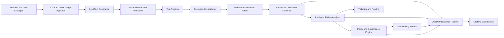

# Autonomous Regression Platform Technical Architecture

## Purpose

This document defines the target technical architecture for an AI-powered autonomous regression testing platform for microservices. It translates the strategy in [PLATFORM_CHARTER.md](PLATFORM_CHARTER.md) and the operating steps in [AUTONOMOUS_REGRESSION_PLATFORM_STEPS.md](AUTONOMOUS_REGRESSION_PLATFORM_STEPS.md) into concrete platform components, data flow, and service boundaries.

## Architecture Goals

- generate regression tests from contracts, change signals, and production evidence
- execute tests reliably on Kubernetes
- detect and classify failures with evidence-backed intelligence
- apply bounded self-healing actions under policy
- expose platform health and quality intelligence through Grafana
- retain governance and auditability for every autonomous decision

## Core Platform Domains

The platform is organized into six domains.

1. Test intelligence
2. Execution orchestration
3. Failure intelligence
4. Healing and policy enforcement
5. Telemetry and analytics
6. Governance and integration

## Logical Components

### 1. Contract and change ingestion service

Responsibilities:

- ingest OpenAPI specs, protobuf definitions, consumer-driven contracts, and workflow metadata
- ingest Git diffs, deployment manifests, release metadata, and defect history
- normalize service metadata for downstream generation and prioritization

Inputs:

- source repositories
- API contracts
- CI/CD metadata
- incident and defect systems

Outputs:

- normalized service contract records
- change-risk signals
- service ownership metadata

### 2. LLM test generation service

Responsibilities:

- generate candidate API, integration, and end-to-end tests
- generate assertions, parameter combinations, and negative scenarios
- score candidate tests for novelty, business risk, duplication, and execution cost

Subcomponents:

- prompt builder
- model gateway
- test candidate evaluator
- provenance recorder

Outputs:

- candidate test definitions
- confidence scores
- provenance metadata
- coverage tags and service mappings

### 3. Test validation and admission service

Responsibilities:

- validate generated tests against schemas and contract rules
- reject malformed, duplicate, or policy-breaking tests
- assign execution tier and scheduling priority

Admission rules should check:

- contract compliance
- secret leakage
- duplicate coverage
- unsafe actions against restricted flows
- unsupported dependencies or missing environment prerequisites

### 4. Test registry and versioned artifact store

Responsibilities:

- store approved generated tests and hand-authored suites
- version test definitions, prompts, model metadata, and evidence
- track lifecycle state such as candidate, approved, quarantined, expired, or deprecated

### 5. Execution orchestrator

Responsibilities:

- schedule and dispatch test runs to Kubernetes
- support PR, nightly, canary, and release-qualification modes
- shard and parallelize runs based on suite size, service risk, and cluster capacity
- coordinate retries and reruns according to policy

Subcomponents:

- run planner
- queue manager
- sharding planner
- execution controller
- retry controller

### 6. Kubernetes execution fabric

Responsibilities:

- run test jobs as pods or jobs in isolated namespaces when needed
- provision dependencies, stubs, service virtualization, and seeded data
- capture runtime artifacts and execution telemetry

Runtime assets:

- test runner images
- ephemeral namespaces
- config maps and secrets
- sidecars or agents for log and trace collection
- storage for artifacts and evidence

### 7. Artifact and evidence collector

Responsibilities:

- collect logs, traces, screenshots, videos, pod events, and network captures
- attach run metadata such as service, commit, release, and environment
- persist evidence in searchable storage for triage and dashboards

### 8. Intelligent failure analysis service

Responsibilities:

- classify each failure as product defect, flaky, environment, dependency, contract drift, or test issue
- correlate test failures with logs, traces, deploy changes, and recent incidents
- generate evidence-backed summaries, owner suggestions, and routing recommendations

Subcomponents:

- failure enricher
- classifier
- correlation engine
- RCA summarizer
- routing recommender

### 9. Self-healing service

Responsibilities:

- apply bounded healing actions to approved failure categories
- distinguish transient runtime healing from persistent suite change recommendations
- report action outcome and confidence to governance telemetry

Allowed examples:

- adaptive waits
- transient dependency retry
- environment resync
- test data refresh
- locator fallback for approved UI flows

Blocked examples:

- mutating assertions silently
- changing protected branch tests without review
- bypassing security-critical or payment-critical validation

### 10. Policy and governance engine

Responsibilities:

- enforce rules for test admission, auto-routing, healing, quarantine, and release gates
- evaluate confidence thresholds and service criticality
- preserve audit records for all automated decisions

### 11. Quality intelligence pipeline

Responsibilities:

- transform platform events into KPI-ready facts
- produce service, release, and portfolio-level aggregates
- power Grafana dashboards and downstream reporting

### 12. Dashboard and reporting layer

Responsibilities:

- expose quality intelligence to engineers, QA leads, and release managers
- display KPI scorecards, trend analysis, flaky hotspots, AI test yield, and heal effectiveness
- support drill-down from summary metrics to test-run evidence

### 13. External integration adapters

Responsibilities:

- integrate with CI/CD systems
- create or update tickets in Jira or Azure DevOps
- publish annotations to Grafana and observability tools
- ingest service ownership, release, and deployment metadata

## End-to-End Data Flow

## Primary Runtime Flows

### Flow A: Generated test lifecycle

1. The ingestion service receives updated contracts, code changes, and defect history.
2. The LLM generation service creates candidate tests.
3. The admission service validates and scores those candidates.
4. Approved tests are stored in the registry with provenance.
5. The orchestrator schedules execution based on risk tier and release mode.

### Flow B: Regression execution lifecycle

1. CI/CD or a release scheduler requests a regression run.
2. The orchestrator plans shards and target environments.
3. Kubernetes jobs execute tests and stream artifacts.
4. Evidence is persisted and normalized.
5. Failures are classified and routed.

### Flow C: Autonomous healing lifecycle

1. Failure analysis identifies a likely healable failure class.
2. Policy engine evaluates whether healing is allowed for that test and service.
3. Self-healing service applies the bounded action.
4. The run is replayed if policy permits.
5. Outcome is written to governance events and dashboards.

## Deployment Topology

### Control plane services

These services can run as stateless services in Kubernetes:

- contract and change ingestion
- LLM generation
- test admission
- execution orchestrator
- failure analysis
- self-healing service
- policy engine
- integration adapters

### Data plane services

These components carry runtime execution and evidence:

- test jobs and pods
- ephemeral namespaces or sandbox environments
- artifact storage
- message bus or event stream
- metrics and logging backends

### Recommended infrastructure building blocks

- Kubernetes for orchestration and isolation
- object storage for artifacts and evidence
- relational or document store for test registry and governance records
- message bus for event transport
- tracing backend for correlation
- Grafana for visualization

## Service Boundaries

### Boundary 1: Test generation vs admission

Reason:

- generation should maximize idea creation
- admission should independently enforce safety and validity

This separation prevents the model from being the final authority over what is executed.

### Boundary 2: Failure analysis vs healing

Reason:

- classification determines probable cause
- healing determines whether and how to act

This separation keeps diagnosis independent from mutation.

### Boundary 3: Policy engine vs all autonomous actions

Reason:

- release gates, quarantine, healing, and auto-routing should use a single policy authority

Without this, each component invents its own rules and governance breaks down.

### Boundary 4: Dashboard pipeline vs operational services

Reason:

- analytics workloads should not interfere with execution and triage runtime paths

## Canonical Event Model

Every platform component should emit canonical events with a shared envelope.

### Shared envelope

- event ID
- event type
- timestamp
- service name
- environment
- branch
- commit
- release ID
- run ID
- trace ID
- actor type such as system, model, or human
- source component

### Test execution event

- test ID
- suite
- execution mode
- shard ID
- duration
- attempt number
- outcome
- artifact references

### Failure analysis event

- classification
- confidence
- rationale
- evidence references
- owner suggestion
- route decision

### Healing event

- failure fingerprint
- heal action
- confidence
- outcome
- replay performed
- expiry time

### Generated test provenance event

- model name
- prompt version
- source contract
- generation timestamp
- novelty score
- approval status

## API and Integration Contracts

The platform should expose or consume these integration surfaces.

### Internal APIs

- generation request API
- test admission API
- execution request API
- artifact lookup API
- failure analysis API
- healing action API
- KPI aggregation API

### External integrations

- GitHub Actions, Azure DevOps, or Jenkins for run triggers
- Jira or Azure DevOps Boards for ticketing
- OpenTelemetry-compatible telemetry backends for traces and metrics
- Grafana for dashboards and annotations

## Security and Governance Controls

- all generated tests must be scanned for secrets and unsafe actions
- model prompts and outputs must be versioned and auditable
- healing actions must be policy-gated and fully logged
- sensitive flows should require human approval for autonomous actions
- artifact access should follow least privilege

## Reliability and Scale Considerations

- use queue-based orchestration to absorb bursty regression demand
- shard by service, test type, or workflow criticality
- isolate noisy or unstable suites with quarantine controls
- retain evidence long enough for audit and trend analysis
- monitor cluster saturation, execution latency, and artifact pipeline health

## Suggested Phased Build

### Phase 1

- canonical event schema
- Kubernetes execution
- evidence capture
- initial failure classification

### Phase 2

- Grafana dashboards
- KPI scorecards
- service-level and release-level drilldowns

### Phase 3

- LLM-generated regression candidates
- admission controls
- provenance and approval workflows

### Phase 4

- self-healing for approved failure classes
- replay orchestration
- heal effectiveness reporting

### Phase 5

- risk-based release gates
- service criticality policies
- broader autonomous portfolio rollout

## Staff SDET Decisions That Must Be Made Explicit

- what evidence is required before a failure can be auto-routed
- what healing actions are allowed per service tier
- what confidence threshold qualifies a generated test for execution
- what data completeness threshold is required for KPI trust
- what critical workflows are excluded from unsupervised autonomy

## Definition of Done for the Architecture

The architecture is viable when:

- generated tests can be created, validated, and versioned safely
- tests execute at scale on Kubernetes with consistent evidence capture
- failures can be classified with actionable evidence
- healing actions are bounded and audited
- Grafana dashboards expose KPI health and release risk
- governance rules are enforceable from a single policy layer